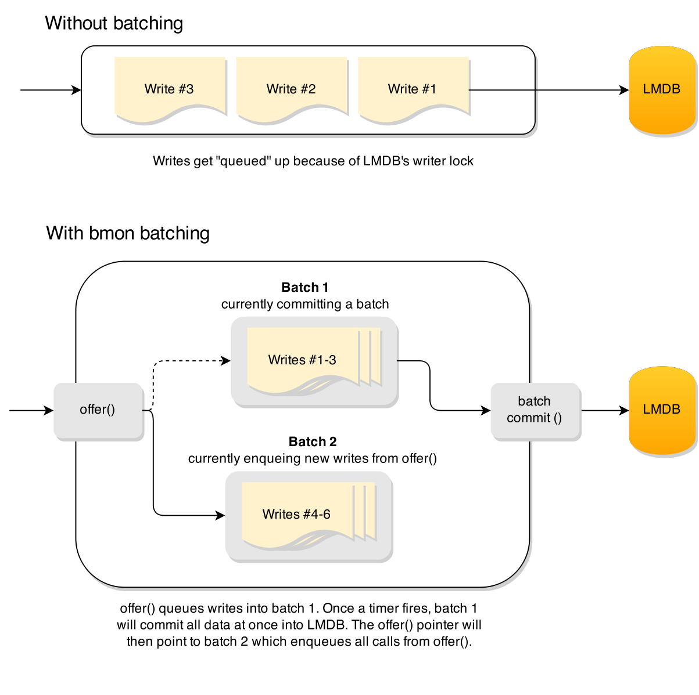

Most of the time it's most efficient to batch work.

But.. if you have multiple threads this can be difficult to coordinate, especially if the threads need to respond to clients quickly.

bmon (aka batching `monitor <http://en.wikipedia.org/wiki/Monitor_(synchronization)>`_) makes it easy to batch work from multiple threads.

Case study: Batching PearDB's LMDB writes
-----------------------------------------
LMDB only allows a single writer. To get around this it's best to batch your writes into a single transactionn.

This is what `PearDB <http://github.com/willemt/peardb>`_ does.

**Checkout the sweet speed up:**

**Before**

.. code-block:: bash

    bench [master] λ wrk -d 10 -c 30 -t 30 --latency -s writeonly-pipelining.lua http://127.0.0.1:8888                                                                                              ~/d/p/bench
    Running 10s test @ http://127.0.0.1:8888
      30 threads and 30 connections
      Thread Stats   Avg      Stdev     Max   +/- Stdev
        Latency   154.77ms    2.34ms 173.90ms   98.00%
        Req/Sec   102.79      1.80   107.00     79.00%
      Latency Distribution
         50%  154.57ms
         75%  155.03ms
         90%  155.81ms
         99%  173.10ms
      30947 requests in 9.98s, 5.11MB read
    Requests/sec:   3102.23
    Transfer/sec:    524.11KB

**After**

.. code-block:: bash

    bench [feature/batch_write-rebase] λ wrk -d 10 -c 30 -t 30 --latency -s writeonly-pipelining.lua http://127.0.0.1:8888                                                                           ~/d/p/bench
    Running 10s test @ http://127.0.0.1:8888
      30 threads and 30 connections
      Thread Stats   Avg      Stdev     Max   +/- Stdev
        Latency    17.61ms    4.06ms  36.44ms   92.52%
        Req/Sec     0.94k   130.62     1.18k    90.95%
      Latency Distribution
         50%   16.59ms
         75%   17.27ms
         90%   18.22ms
         99%   33.10ms
      269407 requests in 9.97s, 44.45MB read
    Requests/sec:  27009.81
    Transfer/sec:      4.46MB 
